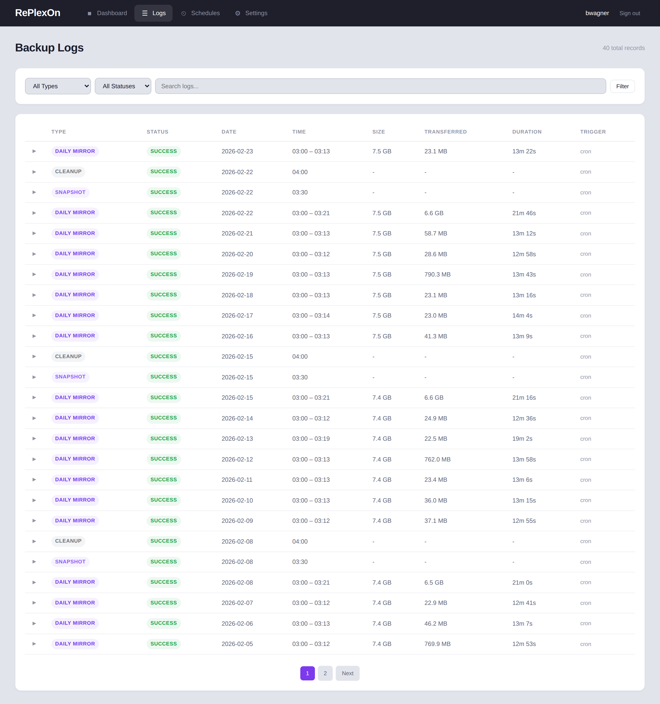
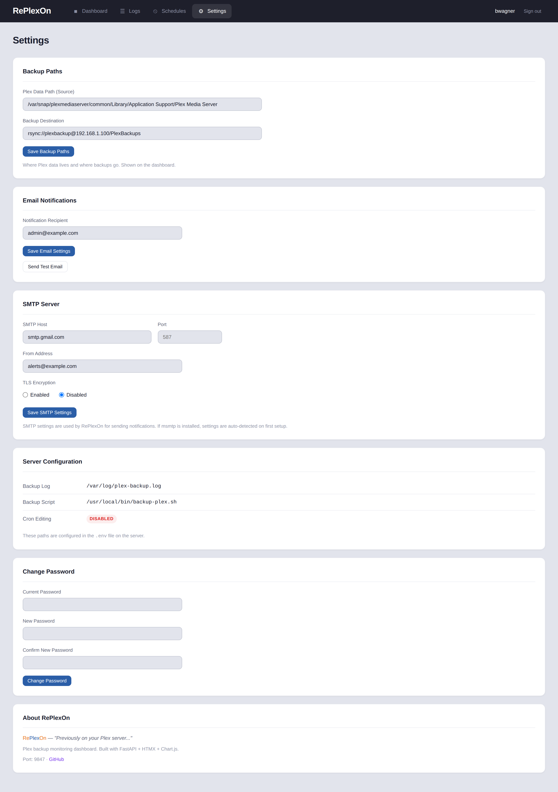
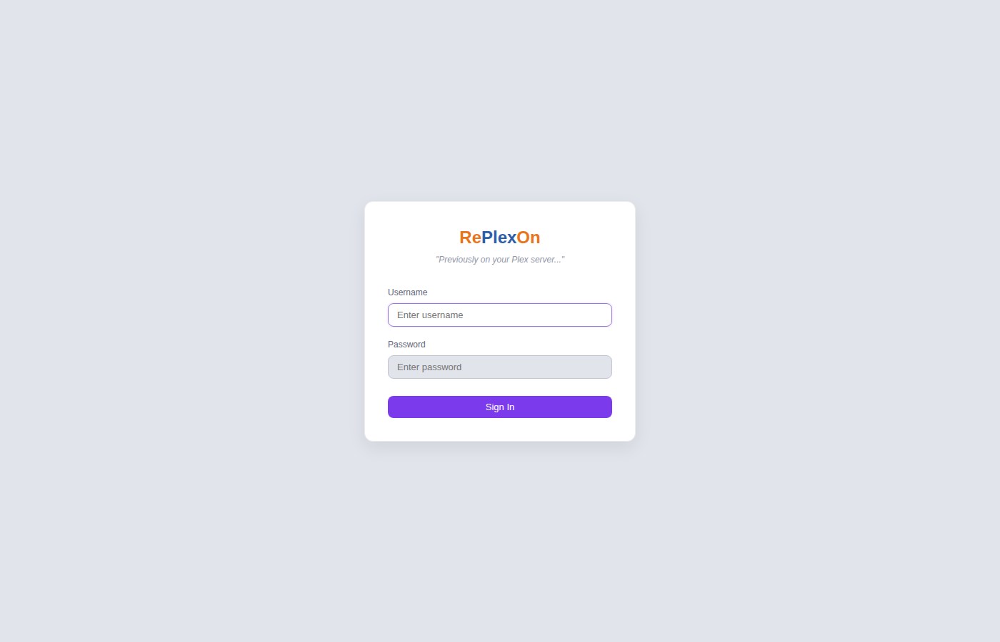

```
  ____       ____  _            ___
 |  _ \ ___ |  _ \| | _____  __/ _ \ _ __
 | |_) / _ \| |_) | |/ _ \ \/ / | | | '_ \
 |  _ <  __/|  __/| |  __/>  <| |_| | | | |
 |_| \_\___||_|   |_|\___/_/\_\\___/|_| |_|
 ==========================================
      "Previously on your Plex server..."
```

# RePlexOn

A self-hosted backup system and monitoring dashboard for Plex Media Server. RePlexOn backs up your Plex **configuration, database, metadata, and settings** to a NAS or Synology device via rsync, then gives you a clean web dashboard to monitor backup status, browse history, view transfer stats, manage schedules, and configure email alerts.

> **What gets backed up:** Plex stores its database, watch history, user accounts, posters/artwork, plugin data, preferences, and server settings in a data directory separate from your media files. This is what RePlexOn protects. **Your actual media library (movies, TV shows, music) is NOT backed up** -- those files are typically too large for this approach and should be managed separately. RePlexOn backs up everything you'd need to rebuild a Plex server without re-scanning and reconfiguring from scratch.

**This project is provided as-is, free and open source under the MIT license.** It was built to solve a real problem on a real Plex server and is shared in the hope that it may be useful to others running similar setups. No warranty or support is provided -- see [Disclaimer](#disclaimer) below.

---

## Screenshots

| Dashboard | Backup Logs |
|:-:|:-:|
|  |  |

| Settings | Login |
|:-:|:-:|
|  |  |

---

## What It Does

RePlexOn has two parts:

### 1. Backup Scripts
Three bash scripts (in `scripts/`) handle the actual backup work via cron. They target the **Plex data directory** -- the folder where Plex stores its database, metadata, thumbnails, watch history, user preferences, and server configuration (typically 5-50 GB depending on library size and metadata agents). This is NOT your media library.

- **Daily mirror** (3 AM) -- rsync the Plex data directory to a NAS using rsync daemon protocol
- **Weekly snapshots** (Sundays) -- after the daily mirror, create a dated copy for point-in-time recovery
- **Snapshot cleanup** (Sunday 4 AM) -- remove old weekly snapshots, keeping the most recent 4
- **Config self-backup** (1st of month) -- back up all scripts and configs to the NAS

### 2. Web Dashboard
A FastAPI web application that reads the backup log files and presents:

- **At-a-glance status** -- last backup result, total size, success rate, backup count
- **Source and destination paths** -- see exactly where data is coming from and going to
- **Size charts** -- track backup size over time with daily bar charts
- **Backup type breakdown** -- doughnut chart showing daily mirrors vs snapshots vs cleanups
- **Full history** -- filterable, searchable log table with expandable detail rows
- **Schedule viewer** -- reads your crontab and displays schedules in human-readable format
- **Manual trigger** -- run a backup on demand with rate limiting
- **Email notifications** -- SMTP configuration with test email (auto-detects msmtp if installed)
- **Settings UI** -- configure backup paths, email, SMTP, and change password from the browser

### How It Works

The backup scripts write structured log markers to `/var/log/plex-backup.log`:

```
=== Plex Backup Started: Mon Feb 23 03:00:01 AM EST 2026 ===
...rsync output...
sent 24,265,611 bytes  received 114,210,946 bytes
total size is 8,081,447,228  speedup is 58.36
=== Plex Backup Completed Successfully: Mon Feb 23 03:13:23 AM EST 2026 ===
```

A lightweight tracking file (`plex-backup-tracking.log`) records daily results:

```
2026-02-20:success
2026-02-21:success
2026-02-22:failed
```

RePlexOn's background poller reads these files every 60 seconds, parses the markers, extracts transfer statistics, and stores everything in a local SQLite database. The dashboard then queries this database to render charts and tables.

---

## Requirements

- **OS**: Ubuntu 20.04+ or Debian 11+ (the installer checks for this)
- **Python**: 3.9 or newer
- **Plex Media Server**: Any installation method (snap, apt, manual)
- **Backup target**: A NAS or Synology device with rsync daemon enabled (or any rsync-compatible destination)
- **~50 MB disk**: For the app, venv, and database
- **Network**: The Plex server must be able to reach the NAS via rsync (port 873) and optionally SSH (port 22 for snapshot cleanup)

### Python Dependencies

All handled automatically by the installer or `pip install -r requirements.txt`:

```
fastapi>=0.115.0
uvicorn[standard]>=0.34.0
jinja2>=3.1.4
python-multipart>=0.0.18
sqlalchemy>=2.0.36
pydantic-settings>=2.6.0
argon2-cffi>=23.1.0
click>=8.1.7
```

No npm, no Node.js, no build tools. HTMX and Chart.js are vendored in `app/static/js/`.

---

## Quick Start

### Automated Install (Recommended)

```bash
git clone https://github.com/wickedhardflip/replexon.git
cd replexon
sudo bash install.sh --interactive
```

The interactive installer will:

1. Verify you're on Ubuntu/Debian and running as root
2. Install system dependencies (`python3`, `python3-venv`, `rsync`, optionally `msmtp`)
3. Copy the app to `/opt/replexon` and create a Python virtual environment
4. Auto-detect your Plex data path (checks snap, apt, and manual install locations)
5. Prompt for NAS IP, rsync user/module, email settings
6. Generate a cryptographic `SECRET_KEY` and write the `.env` file
7. Install backup scripts to `/usr/local/bin/` with your settings
8. Create `/etc/replexon/rsync.secret` (chmod 600) for rsync password storage
9. Offer to add cron entries for the backup schedule
10. Install and enable the systemd service
11. Initialize the database and create your admin account

A non-interactive mode (`sudo bash install.sh`) is also available -- it installs everything with defaults and prints the manual steps remaining.

### Manual Setup

```bash
# Clone
git clone https://github.com/wickedhardflip/replexon.git
cd replexon

# Python environment
python3 -m venv venv
source venv/bin/activate
pip install -r requirements.txt

# Configure
cp .env.example .env
nano .env  # Set SECRET_KEY and backup paths

# Initialize
python replexon.py init-db
python replexon.py create-user --username admin --admin

# Run
uvicorn app.main:app --host 0.0.0.0 --port 9847
```

Then visit `http://your-server:9847`

---

## Backup Scripts

The `scripts/` directory contains production-ready backup scripts for rsync to a NAS/Synology:

| Script | Schedule | Purpose |
|---|---|---|
| `backup-plex.sh` | Daily 3 AM | Mirror Plex data to NAS + Sunday dated snapshots |
| `cleanup-plex-snapshots.sh` | Sunday 4 AM | SSH to NAS, remove old snapshots (keeps 4) |
| `backup-scripts.sh` | 1st of month 5 AM | Collect all scripts/configs, rsync to NAS |

Each script has clearly marked configuration variables at the top. Edit these to match your setup:

```bash
PLEX_DATA="/var/lib/plexmediaserver/Library/Application Support/Plex Media Server"
NAS_IP="192.168.1.100"
RSYNC_USER="backupuser"
RSYNC_MODULE="plex-backups"
RSYNC_PASSWORD_FILE="/etc/replexon/rsync.secret"
```

**Credential handling**: rsync passwords are read from a file (`--password-file`), never embedded in scripts. The credential file is stored at `/etc/replexon/rsync.secret` with mode 600.

See [`scripts/README.md`](scripts/README.md) for detailed setup instructions including NAS rsync daemon configuration, SSH key setup for the cleanup script, and crontab entries.

---

## Configuration

### Environment Variables (`.env`)

| Variable | Default | Description |
|---|---|---|
| `SECRET_KEY` | *(required)* | Random string for session signing. Generate with: `python3 -c "import secrets; print(secrets.token_hex(32))"` |
| `APP_HOST` | `0.0.0.0` | Bind address |
| `APP_PORT` | `9847` | Web dashboard port |
| `BACKUP_LOG_PATH` | `/var/log/plex-backup.log` | Path to the rsync backup log file |
| `BACKUP_SCRIPT_PATH` | `/usr/local/bin/backup-plex.sh` | Path to the backup script (for manual trigger) |
| `BACKUP_DESTINATION` | *(optional)* | Displayed on dashboard (e.g., `rsync://user@NAS/module`) |
| `PLEX_DATA_PATH` | *(optional)* | Displayed on dashboard (auto-detected by installer) |
| `CRON_EDIT_ENABLED` | `false` | Allow editing cron schedules via the web UI |
| `CRON_USER` | `root` | User whose crontab to read for schedule display |
| `LOG_POLL_INTERVAL` | `60` | Seconds between log file checks |
| `BACKUP_COOLDOWN` | `300` | Minimum seconds between manual backup triggers |

---

## Production Deployment

### systemd Service

The included service file runs RePlexOn as a non-root user with security hardening:

```bash
sudo cp systemd/replexon.service /etc/systemd/system/
# Edit User= and Group= if needed
sudo systemctl daemon-reload
sudo systemctl enable replexon
sudo systemctl start replexon
```

Security features in the service file:
- `ProtectSystem=strict` -- read-only filesystem except allowed paths
- `PrivateTmp=true` -- isolated temp directory
- `ReadWritePaths=/opt/replexon/data` -- only the data directory is writable
- `ReadOnlyPaths` -- backup logs are read-only
- `MemoryMax=256M`, `CPUQuota=25%` -- resource limits

### Crontab Access

If your backup cron jobs run as root, the service user needs sudo access to read the crontab:

```bash
# /etc/sudoers.d/replexon
plex ALL=(root) NOPASSWD: /usr/bin/crontab -l -u root
```

### Import Historical Data

If you have existing backup logs, import the history after first deploy:

```bash
cd /opt/replexon
source venv/bin/activate
python replexon.py import-logs
```

---

## CLI Commands

RePlexOn includes a TV-themed CLI:

```bash
python replexon.py init-db              # Initialize database tables
python replexon.py create-user          # Create a user account (--admin for admin)
python replexon.py import-logs          # Import backup history from log files
python replexon.py reset-password       # Reset a user's password

python replexon.py --broadcast          # Trigger a manual backup
python replexon.py --rerun              # Show the most recent backup info
python replexon.py --static             # Health check on backup files
```

---

## Security

### Application Security

- **Authentication**: Argon2id password hashing (memory-hard, resistant to GPU/ASIC attacks)
- **Sessions**: Cryptographically random 64-character hex tokens, server-side storage, 30-day expiry
- **CSRF Protection**: HMAC-signed tokens on all POST forms
- **No JavaScript frameworks**: HTMX and Chart.js are vendored -- no CDN dependencies, no supply chain risk
- **No external API calls**: The app never phones home or contacts external services
- **SQLite WAL mode**: Concurrent reads without blocking, crash-safe writes

### Credential Security

- rsync passwords are stored in `/etc/replexon/rsync.secret` (chmod 600), never in scripts
- The `.env` file (containing `SECRET_KEY`) is chmod 600 and excluded from git
- SMTP passwords are never stored -- RePlexOn delegates to msmtp which manages its own credentials
- The `scripts/rsync.secret` pattern is in `.gitignore` to prevent accidental commits

### Security Scanning

This codebase has been scanned with [Semgrep](https://semgrep.dev/) (static analysis for Python/web security issues) with **0 findings**. We recommend running your own scans after any customization:

```bash
pip install semgrep
semgrep scan --config auto app/
```

### systemd Hardening

The included service file restricts the application to:
- Read-only access to the root filesystem (`ProtectSystem=strict`)
- Write access only to `/opt/replexon/data`
- Read-only access to backup log files
- Private temp directory, memory and CPU limits

---

## Project Structure

```
replexon/
  app/
    main.py              # FastAPI app + background log poller
    config.py            # Pydantic Settings (.env loading)
    database.py          # SQLAlchemy engine (SQLite WAL)
    models/              # User, Session, BackupRun, AppSetting
    routers/             # Auth, Dashboard, Logs, Schedules, Settings
    services/            # Log parser, metrics, cron, backup runner, email
    templates/           # Jinja2 (base + pages + components)
    static/              # CSS, JS (HTMX + Chart.js vendored), images
  scripts/
    backup-plex.sh       # Daily mirror + Sunday snapshots
    cleanup-plex-snapshots.sh  # Weekly snapshot retention
    backup-scripts.sh    # Monthly config self-backup
    rsync.secret.example # Credential file template
    README.md            # Detailed script setup guide
  docs/
    screenshots/         # Dashboard screenshots
  systemd/               # systemd unit file
  install.sh             # Automated installer (default + interactive)
  replexon.py            # CLI entry point
  requirements.txt       # Python dependencies
```

## Tech Stack

| Layer | Technology |
|---|---|
| **Backend** | Python 3.9+, FastAPI, SQLAlchemy 2.0, Pydantic Settings |
| **Database** | SQLite with WAL mode (zero configuration) |
| **Frontend** | Jinja2 templates, HTMX 2.0, Chart.js 4.x |
| **Auth** | Argon2id hashing, server-side sessions, HMAC CSRF tokens |
| **Backup** | rsync daemon protocol, bash scripts, cron scheduling |
| **Deployment** | systemd service with security hardening |

No npm. No Node.js. No build step. No external CDN dependencies.

---

## Customization

RePlexOn was built for a specific setup (Ubuntu server + Synology NAS via rsync daemon protocol) but can be adapted:

- **Different NAS**: The backup scripts use standard rsync -- any rsync-compatible target works. Edit the variables at the top of each script.
- **Different Plex install**: Change `PLEX_DATA` in `backup-plex.sh` to match your Plex data location.
- **Different backup method**: If you don't use rsync daemon protocol, modify the rsync commands. For SSH-based rsync, replace `rsync://user@host::module` with `user@host:/path/` syntax.
- **Log format**: If you write your own backup script, match the log marker format exactly (see [How It Works](#how-it-works)) or the dashboard won't parse your logs.
- **Port**: Change `APP_PORT` in `.env` (default 9847).

---

## Disclaimer

**This software is provided "as-is" without warranty of any kind, express or implied.** Use at your own risk.

RePlexOn is a personal project shared freely in the hope that it may be useful to others managing Plex backup systems. It is not a commercial product. Specifically:

- **No warranty**: There is no guarantee that this software will work correctly in your environment, protect your data, or be free of bugs.
- **No support**: This is not a supported product. Issues and pull requests on GitHub are welcome but responses are not guaranteed.
- **Your responsibility**: You are solely responsible for verifying that your backups are working correctly. Do not rely on this dashboard as your only confirmation that backups are running -- periodically verify your backup files directly on the NAS.
- **Customization expected**: This was built for a specific setup. You will likely need to adjust paths, credentials, and configuration to match your environment.
- **Security**: While we have taken care to follow security best practices and have run static analysis scans, no software is guaranteed to be free of vulnerabilities. Run your own security review before exposing this to untrusted networks.
- **Data loss**: The authors are not responsible for any data loss resulting from the use or misuse of this software or its backup scripts.

See the [MIT License](LICENSE) for full terms.

---

## Contributing

Contributions are welcome. If you find a bug, have a feature request, or want to adapt RePlexOn for a different backup setup, feel free to open an issue or pull request.

## License

[MIT](LICENSE) -- free to use, modify, and distribute.
